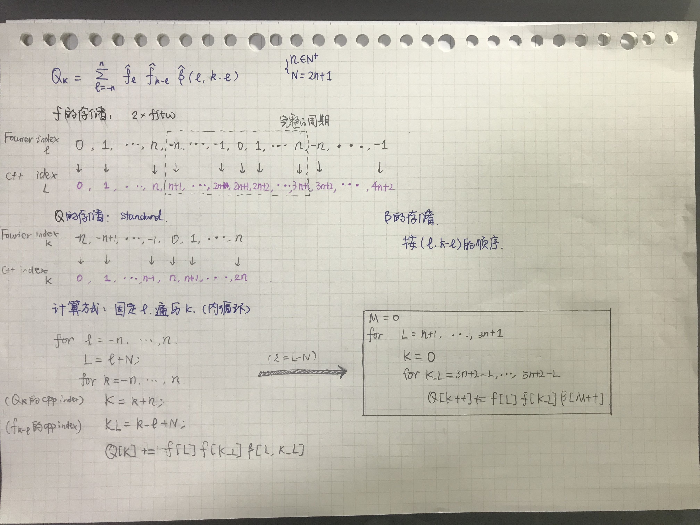
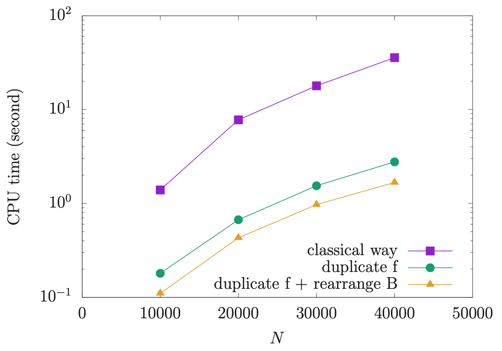

# Boltzmann entropy code

## 1. Calculating Q

### 1.1 1d illustration



Goal:
$$
Q_{k}=\sum_{l=-n}^{n} \hat{f}_{l} \hat{f}_{k-l} \hat{\beta}(l, k-l),\quad k = -n,\dots,n
$$

| Method                          | description                                                  |
| ------------------------------- | ------------------------------------------------------------ |
| Classical way                   | $f$ 标准顺序存储，$\hat{\beta}$ 按$(l,k)$二维数组存储        |
| duplicate $f$                   | $f$ 按2倍的fftw3顺序存储，$\hat{\beta}$ 按$(l,k)$二维数组存储 |
| duplicate $f$ and rearrange $B$ | $f$ 按2倍的fftw3顺序存储，$\hat{\beta}$ 按$(l,k-l)$二维数组存储 |



​	

3d example

| 1d数组+行或列存储 | `i->j（f[n-j]）` | `j->i（f[i]）`+2层 | $3^3$倍f   |
| ----------------- | ---------------- | ------------------ | ---------- |
| n=$25^3$          | 0.33             | 0.32               | 0.24       |
| n=$27^3$          | 0.53(4.82)       | 0.51(4.81)         | 0.38(4.56) |
| n=$29^3$          | 0.81             | 0.77               | 0.58       |
| n=$31^3$          | 1.29             | 1.15               | 0.86       |
| n=$33^3$          | 1.77             | 1.75               | 1.24       |
| n=$35^3$          | 2.50             | 2.43               | 1.72       |
|                   | 100%             | >96%               | 70%        |


## 2. Evaluation of B

[**G. Dimarco and L. Pareschi 2014**] Section 5.1
$$
\hat{Q}_{k}=\sum_{l=-N }^{N} \hat{f}_{l} \hat{f}_{k-l} \hat{\beta}(l, k-l), \quad k=-n, \ldots, n
$$
where the Boltzmann kernel modes $\hat{\beta}(l, m)=\hat{B}(l, m)-\hat{B}(m, m)$ are now given by 
$$
\hat{B}(l, m)=\int_{\mathcal{B}_{0}(2 \lambda \pi)} \int_{\mathbb{S}^{2}}|q| \sigma(|q|, \cos \theta) e^{-i\left(l \cdot q^{+}+m \cdot q^{-}\right)} d \omega d q
$$
In the VHS case, $|q| \sigma(|q|, \cos \theta)=C_{\alpha}|q|^{\alpha}$ where we can chose $C_{\alpha}=\left((4 \pi)^{2}(2 \lambda \pi)^{3+\alpha}\right)^{-1}$. Furthermore, the integral can be reduces to a one-dimensional integral (Pareschi and Russo 2000b)
$$
\hat{B}(l, m)=\int_{0}^{1} r^{2+\alpha} \operatorname{Sinc}(\xi r) \operatorname{Sinc}(\eta r) d r=F_{\alpha}(\xi, \eta)
$$
where $\xi=|l+m| \lambda \pi, \eta=|l-m| \lambda \pi$, $\lambda = 2/(3+\sqrt{2})$. We report the expressions for the case of Maxwell molecules $\alpha = 0$ and hard spheres $\alpha = 1$
$$
\begin{aligned} F_{0}(\xi, \eta) &=\frac{p \sin (q)-q \sin (p)}{2 \xi \eta p q} \\ F_{1}(\xi, \eta) &=\frac{q \sin (q)+\cos (q)}{2 \xi \eta q^{2}}-\frac{p \sin (p)+\cos (p)}{2 \xi \eta p^{2}}-\frac{2}{p^{2} q^{2}} \end{aligned}
$$
where $p=(\xi+\eta), q=(\xi-\eta)$.

Special cases
$$
\begin{aligned}
F_0(\xi,0) &= \frac{-\xi \cos (\xi) + \sin (\xi)}{\xi^3}\\
F_0(0,0) &= \frac{1}{3}\\
F_0(\xi,\xi) &= \frac{\xi-\cos(\xi)\sin(\xi)}{2\xi^3}\\
F_1(\xi,0)  &= \frac{-2-(-2+\xi^2)\cos(\xi) + 2\xi \sin (\xi)}{\xi^4}\\
F_1(0,0)  &= \frac{1}{4}\\
F_1(\xi,\xi) &= -\frac{-1-2\xi^2+\cos(2\xi) + 2\xi \sin (2\xi)}{8\xi^4}
\end{aligned}
$$


## 3. Runge--Kutta method

1. initial guess
2. fftw3 interface
3. 1rk-4
4. nofiltering: for smooth case, it enjoys higher accuracy
5. change to array for faster evaluation

## 4. Experiments

Remarks

1. $J_{max} = N/2 + c, c < N/2$

```
 ./testBKW3D 17 0.000855 0.5 490
```

+ entropy tu
+ 比较误差 dt 取非常小， 
+ 不加entropy fix

Setup

| Forward Euler                                                | Detail |
| ------------------------------------------------------------ | ------ |
| $T_\mathrm{END}$                                             | 0.08   |
| $\Delta t_{fe}=\frac{1-\exp (-\beta  \Delta t_\mathrm{cfe})}{\beta }$ | 0.0007 |
|                                                              |        |


